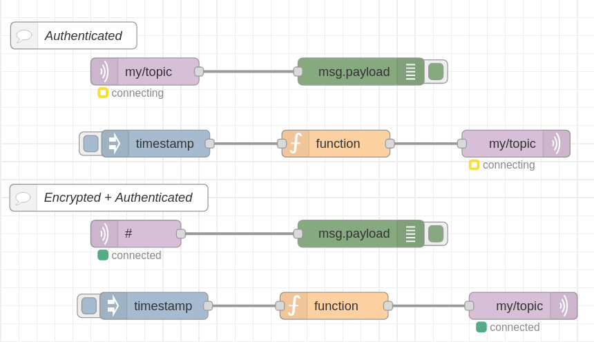
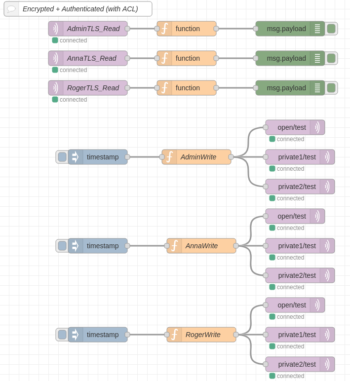

# Authenticated/Encrypted Mosquitto MQTT broker with Docker and NodeRED

Docker-compose to run an authenticated/encrypted [Mosquitto](https://mosquitto.org/) MQTT broker.

## Authenticated
* in ```conf/mosquitto.conf```
  * set ```require_certificate false``` 
  * set ```listener 1883```
  * comment or remove ```cafile /mosquitto/cert/ca.crt```, ```certfile /mosquitto/cert/server.crt```, and ```keyfile /mosquitto/cert/server.key```
* run ```docker-compose up```
* on a different terminal run ```mosquitto_sub -h localhost -p 1883 -t "#" -u admin -P admin``` to subscribe to any topic
* on a different terminal run ```mosquitto_pub -h localhost -p 1883 -t my/topic -m "message" -u admin -P admin``` to publish on the my/topic

Use the mosquitto_flow_NodeRED.json to create a flow in NodeRED with publisher/subscriber

* to add/change users use ```mosquitto_passwd /mosquitto/config/password.txt USER_NAME``` from the mosquitto container (```docker-compose exec mosquitto sh```). Use the ```-c``` option to create or overwrite the password file.

## TSL encryption
* in ```conf/mosquitto.conf```
  * set ```require_certificate true``` 
  * set ```listener 8883```
  * uncomment or add ```cafile /mosquitto/cert/ca.crt```, ```certfile /mosquitto/cert/server.crt```, and ```keyfile /mosquitto/cert/server.key```
* run ```create_cert.sh``` to create keys and certificates for server and client
* run ```docker-compose up```
* on a different terminal run ```mosquitto_sub  -h 192.168.1.109 -t "#" -p 8883 -d --cert client_cert/admin.crt --key client_cert/admin.key --cafile cert/ca.crt -u admin -P admin``` to subscribe to any topic
* on a different terminal run ```mosquitto_pub -h 192.168.1.109 -t "my/topic" -m "message" -p 8883 -d --cert client_cert/client.crt --key client_cert/client.key --cafile cert/ca.crt -u admin -P admin``` to publish on the my/topic

### NodeRED
* the flow ```mosquitto_flow_nodeRED.json``` is presented as an example on how to handle the authenticated/encrypted MQTT broker on NodeRED   


## ACL (Access control list)
Three test user are used for testig: Anna (```anna|pass```), Roger (```roger|pass```), Admin (```admin|admin```). Admin can read/write all the topics. Roger can read the ```private1``` topic, while Anna can read the ```private2``` topic. Both Anna and Roger can read/write the ```open``` topic.
 
* in ```conf/mosquitto.conf```
  * set ```acl_file /mosquitto/config/aclfile.txt``` where aclfile is the file with specific rules to implement the controll access as given above. 
* run ```mosquitto_sub  -h 192.168.1.109 -t "#" -p 8883 -d --cert client_cert/admin.crt --key client_cert/admin.key --cafile cert/ca.crt -u admin -P admin``` for the Admin
* run ```mosquitto_sub  -h 192.168.1.109 -t "#" -p 8883 -d --cert client_cert/anna.crt --key client_cert/anna.key --cafile cert/ca.crt -u anna -P pass``` for Anna
* run ```mosquitto_sub  -h 192.168.1.109 -t "#" -p 8883 -d --cert client_cert/roger.crt --key client_cert/roger.key --cafile cert/ca.crt -u roger -P pass``` for Roger
* run ```mosquitto_pub -h 192.168.1.109 -t "open/test" -m "open message from Admin" -p 8883 -d --cert client_cert/admin.crt --key client_cert/admin.key --cafile cert/ca.crt -u admin -P admin``` to publish on the open topic. Also Anna and Roger can do the same.
* run ```mosquitto_pub -h 192.168.1.109 -t "private1/test" -m "private message(#1) from Admin" -p 8883 -d --cert client_cert/admin.crt --key client_cert/admin.key --cafile cert/ca.crt -u admin -P admin``` to publish on the private1/test topic. Only Roger and Admin will receive the message. Similarly, messages sent to private2/# will only be read by Anna and Admin (not by Roger).
* run ```mosquitto_pub -h 192.168.1.109 -t "private1/test" -m "private message(#1) from Roger" -p 8883 -d --cert client_cert/roger.crt --key client_cert/roger.key --cafile cert/ca.crt -u roger -P pass```. Nobody will receive this message, since Roger has no write priviledge on private1 topic.

### NodeRED
* the flow ```mosquitto_flow_nodeRED_with_ACL.json``` is presented as an example on how to handle the authenticated/encrypted MQTT broker using access control list on NodeRED   


## Note:
* the ```.env``` file is used to avoid change of ownership of files when running the docker-compose. UID and GID are set to 1000, the default user for Ubuntu.   

## References
* [Mosquitto MQTT tutorial](https://medium.com/himinds/mqtt-broker-with-secure-tls-communication-on-ubuntu-18-04-lts-and-an-esp32-mqtt-client-5c25fd7afe67)
